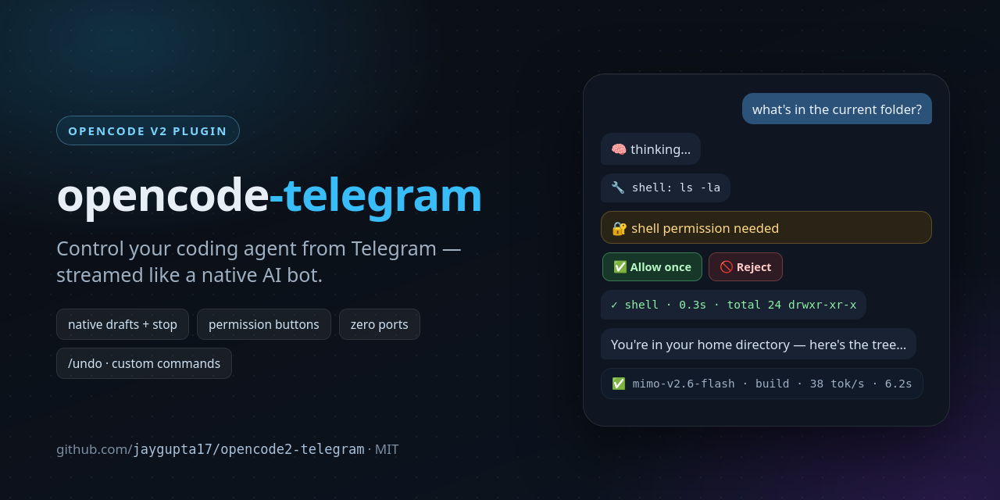

# opencode-telegram

**Your coding agent, in your pocket.** An [OpenCode](https://opencode.ai) v2 plugin that turns a Telegram DM into a full remote control for the agent running on your machine — streamed like Telegram's native AI bots, with approvals, commands, and zero open ports.

[](https://github.com/jaygupta17/opencode2-telegram/actions/workflows/ci.yml)
[](LICENSE)
[](https://opencode.ai)
[](https://telegram.org)



```
[you]  what's in the current folder?
🧠      …thinking streams as a live draft, with a Stop button…
🔧      shell: ls -la
✓       shell · 0.3s · total 24 drwxr-xr-x …
💬      You're in your home directory — here's the tree…
✅      mimo-v2.6-flash · build · 38 tok/s · 6.2s · ctx 21.4k/128k (17%)
```

## Why this one

- **Native streaming, not message spam** — output streams as an animated Telegram draft ("Thinking…" + real Stop button), then lands as final messages. Telegram built drafts for AI bots; this uses them.
- **Strict block order** — every block (thinking · tool call · tool result · answer) is its own message, frozen once complete. No merged walls of text, no scrambled ordering. Thinking renders as muted expandable quotes.
- **Approvals from the couch** — permission requests arrive as cards with **Allow once / Allow always / Reject**. You approve the agent's shell commands from your phone.
- **The whole command surface** — `/model` `/thinking` `/agent` pickers, `/undo` (revert last turn's file changes, with confirm), `/compact`, `/init`, `/sessions`, plus **your own command files become Telegram commands automatically**.
- **Zero ports, zero extra RAM** — runs in-process inside OpenCode, DM-only with a chat-ID allowlist, outbound long-polling only.

## Install (60 seconds)

```sh
# 1. create a bot with @BotFather, copy the token, message the bot once
# 2. add the plugin
opencode plugin add github:jaygupta17/opencode2-telegram
# 3. point it at your bot in ~/.config/opencode/opencode.json → plugins[].options
```

Bootstrap mode: with an empty `allowFrom`, the bot replies to your first DM with your chat ID — paste it in and you're locked to it. Full config table below.

## Features

- **Native streaming drafts** — text streams as an animated Telegram draft ("Thinking…" placeholder) with the built-in stop control; blocks land as real messages when complete
- **Strict block model** — one block = one message: thinking (expandable blockquote) · tool call · tool result (real output in an expandable quote) · text. A message is edited only while its own block streams, then frozen forever
- **Approvals on your phone** — `🔐 permission needed` cards with **Allow once / Allow always / Reject** (`permission.reply`)
- **Full command surface** — core commands (`/new /status /stop /model /thinking /agent /history /sendfile`) plus OpenCode built-ins (`/init /compact /undo /sessions`) and **your own command files auto-exposed** (`~/.config/opencode/commands/*.md` → `/yourcommand`), live-refreshed
- **Button pickers** — model (paginated), agent, thinking variant
- **Turn-end status line** — `✅ model#variant · agent · 42 tok/s · 12.4s · $0.0031 · ctx 23.4k/128k (18%)`
- **Images both ways** — send photos to the agent (multimodal prompts); images referenced in answers are auto-sent, plus `/sendfile`
- **Markdown rendering** — LLM markdown → Telegram HTML (bold/italics/code blocks with syntax highlighting/blockquotes/links), entity-safe splitting past 4096 chars, automatic plain-text fallback
- **Safety** — DM-only, chat-ID allowlist, bootstrap mode (first message gets your chat_id), outbound-only polling (no ports), single-instance lease across opencode processes
- **Ops-friendly** — `/undo` with confirm buttons (revert last turn's file changes), ✅ reaction on your prompt when a turn succeeds, typing indicator

## Requirements

- OpenCode v2 (`@opencode/plugin` 2.0.x — tested against 2.0.16)
- A Telegram bot token from [@BotFather](https://t.me/BotFather)

## Install

1. **Create a bot** — talk to @BotFather → `/newbot` → copy the token. Message your new bot once (any text).

2. **Add the plugin** (via GitHub, no npm needed):

   ```
   opencode plugin add github:jaygupta17/opencode2-telegram
   ```

   or clone and point at the local directory in config.

3. **Configure** `~/.config/opencode/opencode.json`:

   ```jsonc
   {
     "plugins": [
       {
         "package": "github:jaygupta17/opencode2-telegram", // or an absolute path
         "options": {
           "token": "<BotFather token>",   // or set TELEGRAM_BOT_TOKEN
           "allowFrom": []                  // empty = bootstrap: the bot replies with your chat_id
         }
       }
     ]
   }
   ```

4. **Restart/reload** OpenCode (`systemctl --user restart opencode-serve` for the serve unit). Message the bot — in bootstrap mode it replies with your `chat_id`; put it into `allowFrom` and reload again.

## Configuration reference

All options live under the plugin `options` object:

| Option | Default | Description |
| --- | --- | --- |
| `token` | `$TELEGRAM_BOT_TOKEN` | Bot token (env preferred for shared configs) |
| `allowFrom` | `[]` | Allowed chat IDs; empty = bootstrap reply with the chat_id |
| `model` | opencode default | Default model for new sessions (`provider/id` or `provider/id#variant`) |
| `thinking` | model default | Default thinking variant for new sessions (low/medium/high/…) |
| `delivery` | `queue` | How prompts enter a busy session (`queue` \| `steer`) |
| `streaming` | `drafts` | `drafts` (native animated preview + stop) or `edits` |
| `formatting` | `html` | Markdown → Telegram HTML or `plain` |
| `activity` | `per-action` | Tool call/result messages (`per-action` \| `off`) |
| `showReasoning` | `true` | Thinking blocks (expandable blockquotes) |
| `stats` | `true` | Turn-end status line (model/agent/tok-s/time/cost/context) |
| `typing` | `true` | Typing indicator while a turn runs (edits mode) |
| `stopButton` | `true` | Stop control (inline button in edits mode, native in drafts) |
| `autoImages` | `true` | Auto-send local images referenced in answers |
| `toolOutputChars` | `3000` | Max tool output shown in the expandable quote |
| `maxActivityMessages` | `60` | Per-turn cap on activity messages |
| `throttleMs` | `1500` | Min ms between streamed edits of one message |
| `pollTimeoutSec` | `30` | Telegram long-poll timeout |
| `commands` | all on | `{ "builtins": true, "custom": true, "hidden": [] }` |
| `localApi` | auto | `{ "port": 4096, "password": "…" }` override for endpoints outside the plugin API (compact/undo/sessions) |

## Commands

| Command | What it does |
| --- | --- |
| `/new` `/status` `/stop` `/history` | session control |
| `/model` `/thinking` `/agent` | button pickers (model · reasoning variant · agent) |
| `/sessions` | list & switch sessions |
| `/undo` | stage a revert of the last turn → Confirm/Cancel |
| `/init` | guided AGENTS.md setup (OpenCode built-in) |
| `/compact` | compact the session context |
| `/sendfile <path>` | send a local file to the chat |
| `/help` | generated command list |
| `/<your command>` | any file in `~/.config/opencode/commands/` — exposed automatically |

## Architecture (short)

- Runs inside the OpenCode server process as a v2 plugin (zero extra RAM, no ports)
- **Single-instance lease** (`~/.cache/opencode-telegram/loop.lease`, pid + heartbeat) so exactly one opencode process polls Telegram
- **Send queue** per chat (250ms gap, 429/socket retry) to stay inside Telegram limits
- Endpoints outside the plugin domain (`session.compact`, `revert.*`, session list) are reached through a local HTTP self-call with candidate discovery (`local-api.ts`)

## Development

```sh
npm install
npm run typecheck
bash test/harness.sh both   # isolated-HOME plugin load tests (never touches a live server)
```

The harness spins throwaway OpenCode instances (separate `HOME`) and asserts plugin load/cleanup plus a plugin registry entry in both `run --standalone` and `serve` modes.

## Security notes

- The bot is **DM-only** and rejects every chat not in `allowFrom`
- Polling is outbound-only — no inbound ports, no webhooks
- The bot token grants control of your agent: keep config files `chmod 600`
- Prefer `TELEGRAM_BOT_TOKEN` in the environment over a token in config

## License

MIT
